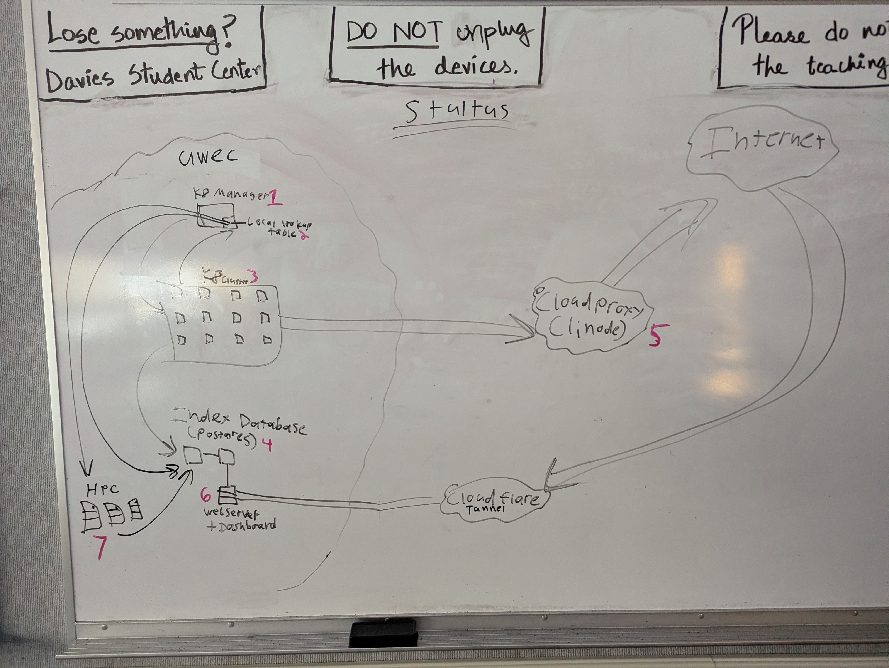

# Architecture

This is where I'm tracking all of my overall system design decisions

## Database

### Domain scraping timeout

We promised the web that we wouldn't touch any domain with less than 10 seconds in between requests

We could likely just do something like randomize the index of inserted urls into the url scraping queue, but we couldn't be absolutely sure that it would be at least a 10 second delay

So instead we need to keep track of exactly when we touch each domain. This would be done at least once per scrape, so its a bottleneck and needs to be as efficient as possible. Therefore, we'll use a Redis database which is in memory. If I'm reading the docs right, we should be able to just have a list of all domains which have been touched in the last 10 seconds and a TTL for each, and we can set up Redis to automatically decrease the TTL every second, so we don't have to keep track of every domain we've ever scraped, just the ones from the last ten seconds

##

